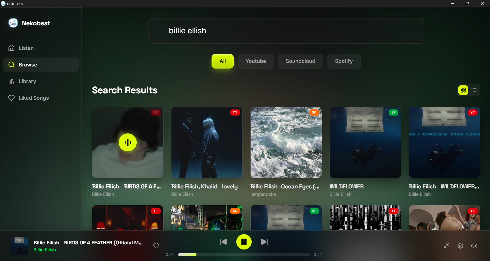
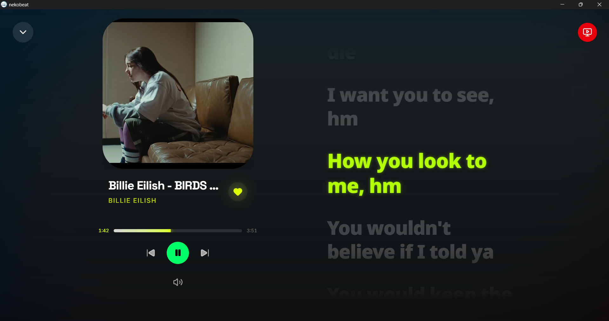
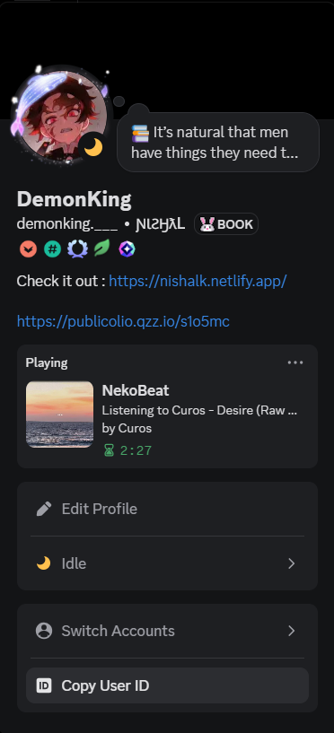
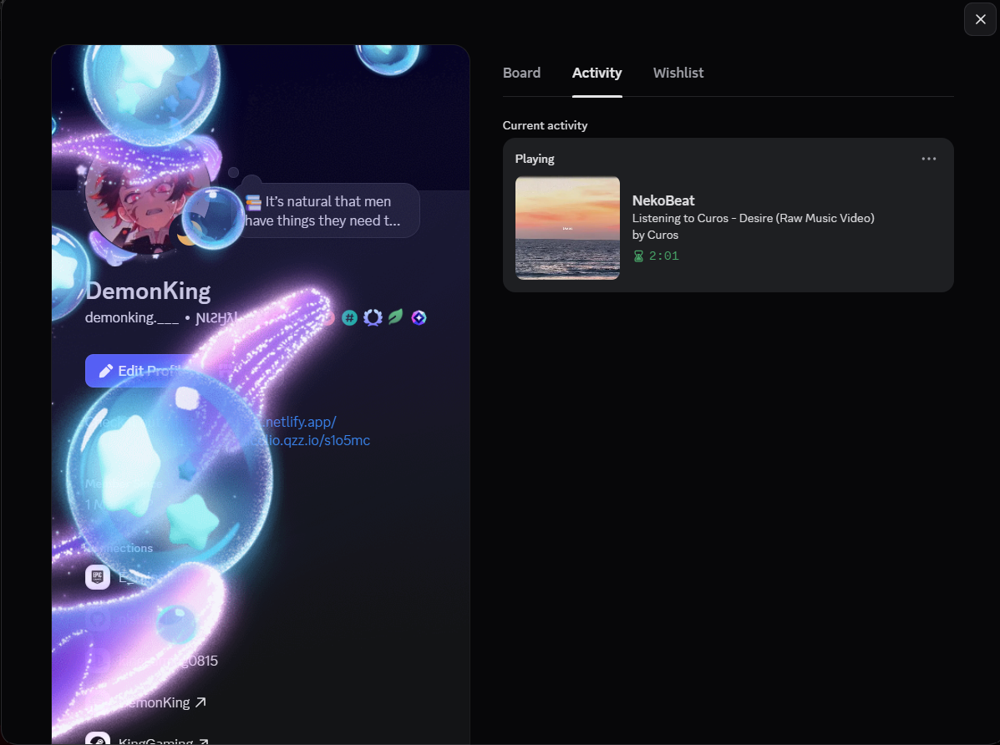
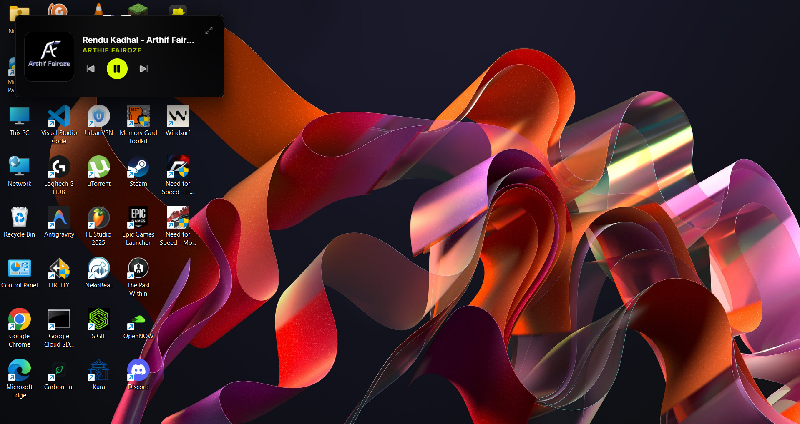
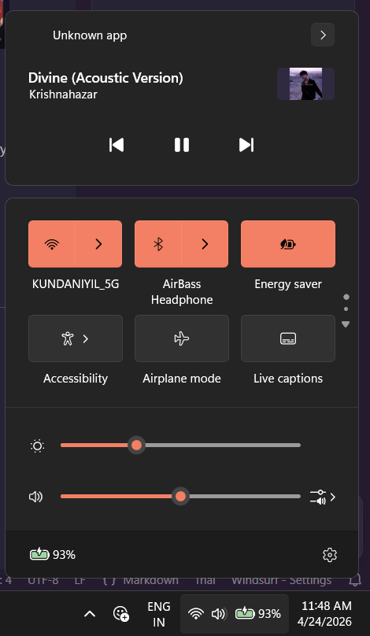

<div align="center">

# NekoBeat

**A native, cross-platform music aggregator built with Rust, React, and GStreamer.**


[](https://v2.tauri.app)
[](https://www.rust-lang.org)
[](https://react.dev)
[](LICENSE)
[](https://discord.gg/kKj8dqq6Je)
[](https://nishal21.github.io/NekoBeat-Website/)

[](https://buymeacoffee.com/kingtanjiro)
[](https://patreon.com/DemonKing08)
[](https://ko-fi.com/demon_king)
[](https://github.com/sponsors/nishal21)

[Download](https://github.com/nishal21/NekoBeat/releases/latest) | [Report Bug](https://github.com/nishal21/NekoBeat/issues) | [Discord](https://discord.gg/kKj8dqq6Je) | [Website](https://nishal21.github.io/NekoBeat-Website/)

</div>

---

NekoBeat is not a wrapper for a website. It is a native, hardware-accelerated audio engine that combines Rust's safety, React's fluidity, and GStreamer's audio pipeline to deliver an audiophile-grade listening experience — without the bloat of Electron.


## Features

### Universal Search & Streaming
Search and stream from **YouTube**, **SoundCloud**, and **Spotify** — all from one unified interface. NekoBeat resolves audio through a custom scraping engine with `yt-dlp` fallback for maximum reliability.




### Offline Library
Every liked track is automatically cached to your local drive. Your library plays instantly with zero latency, regardless of internet connectivity.


### 10-Band Equalizer
A GStreamer-powered equalizer integrated directly into the Rust audio pipeline. 10 frequency bands from 31 Hz to 16 kHz with real-time, stutter-free adjustment.


### Synchronized Lyrics
Auto-fetched lyrics from Genius with manual `.lrc` / `.srt` / `.vtt` upload support. Per-track timing offset adjustment, multi-language rendering, and persistent storage across sessions.


### YouTube Video Sync
When playing YouTube tracks, the music video auto-plays in an embedded window, synchronized with the audio stream.



### Discover (Listen Now)
Live Last.fm scraping surfaces globally trending tracks. One click routes any discovery directly into the search engine.


### Discord Rich Presence
Track titles, artists, remaining time, and album art broadcast to your Discord profile — handled entirely by the Rust backend.





### Auto-Updater
In-app update checking with one-click install. Built on the Tauri updater plugin with signed releases.

### Picture-in-Picture Miniplayer
Compact always-on-top floating player with album art, track info, and playback controls. Click anywhere to drag. One click to shrink, one click to expand back.



### Media Session Integration
Full Windows SMTC / macOS Now Playing integration with play, pause, next, previous, and seek controls.



## Architecture

| Layer | Technology |
|-------|-----------|
| **Core** | Rust |
| **Framework** | Tauri v2 |
| **Frontend** | React + TypeScript |
| **Styling** | Tailwind CSS |
| **Animations** | Framer Motion |
| **Audio Engine** | GStreamer |
| **Stream Resolution** | Custom scraping + yt-dlp fallback |
| **Database** | SQLite (via rusqlite) |
| **Lyrics** | Genius API scraping |

## Installation

### Windows (Recommended)

Install with **winget** for automatic updates:

```powershell
winget install NekoBeat
```

Or download manually from the [Releases](https://github.com/nishal21/NekoBeat/releases/latest) page:
- `NekoBeat_x64-setup.exe` (portable installer)
- `NekoBeat_x64.msi` (system-wide)

> The Windows installer bundles all dependencies including GStreamer — no manual setup required.

### Other Platforms

- **macOS**: Coming soon
- **Linux**: Coming soon
- **Android**: Coming soon

### Build from Source

**Prerequisites:**
- [Node.js](https://nodejs.org/) (LTS)
- [Rust](https://www.rust-lang.org/tools/install)
- [GStreamer](https://gstreamer.freedesktop.org/download/) development libraries
- [`yt-dlp`](https://github.com/yt-dlp/yt-dlp) in your system PATH

```bash
git clone https://github.com/nishal21/NekoBeat.git
cd NekoBeat
npm install
npm run tauri dev
```

### Build a Release

```bash
# Build signed installer (Windows)
.\scripts\build-release.ps1
```

This produces signed `.exe` and `.msi` installers with `.sig` files for the auto-updater.

## Project Structure

```
nekobeat/
├── src/                    # React frontend
│   ├── App.tsx             # Main application
│   └── hooks.ts            # Custom React hooks
├── src-tauri/
│   ├── src/
│   │   ├── main.rs         # Entry point & GStreamer init
│   │   ├── lib.rs          # Tauri command registration
│   │   ├── audio.rs        # GStreamer playback engine
│   │   ├── aggregator/     # Search, resolve, Spotify, SoundCloud
│   │   ├── offline.rs      # Local caching & liked songs
│   │   └── library.rs      # SQLite database operations
│   ├── gstreamer/          # Bundled GStreamer runtime
│   └── binaries/           # External tools (spotiflac-cli)
└── scripts/
    ├── build-release.ps1   # Signed release builder
    └── publish-update.ps1  # Update manifest generator
```

## Acknowledgments

NekoBeat was built with inspiration and reference from these amazing open-source projects:

- **[Harmonoid](https://github.com/harmonoid/harmonoid)** — Beautiful cross-platform music player built with Flutter. Influenced NekoBeat's UI/UX approach and local library management design.
- **[Muffon](https://github.com/staniel359/muffon)** — Advanced multi-source music streaming & discovery client. Inspired the multi-source aggregation architecture.
- **[Muffon API](https://github.com/staniel359/muffon-api)** — Backend API powering Muffon's multi-source integration. Referenced for source aggregation patterns.
- **[SpotiFLAC](https://github.com/afkarxyz/SpotiFLAC)** — Spotify to lossless FLAC downloader via Tidal/Amazon/Deezer fallback chain. Powers NekoBeat's Spotify playback pipeline.
- **[Spotify Lyrics API](https://github.com/akashrchandran/spotify-lyrics-api)** — Lightweight API for fetching synced lyrics from Spotify. Used for real-time lyrics display.
- **[MusicXMatch API](https://github.com/Fabrice-Music/musicxmatch-api)** — TypeScript wrapper for Musixmatch with automatic signature generation. Referenced for lyrics fetching.

Thank you to all the developers and contributors behind these projects.

## Community & Support

- **Discord**: [Join our server](https://discord.gg/kKj8dqq6Je) for discussions, support, and feature requests
- **GitHub Discussions**: [Start a conversation](https://github.com/nishal21/NekoBeat/discussions) — I read every single one!
- **Website**: [NekoBeat](https://nishal21.github.io/NekoBeat-Website/)

## Star History

<a href="https://star-history.com/#nishal21/NekoBeat&Date">
  <picture>
    <source media="(prefers-color-scheme: dark)" srcset="https://api.star-history.com/svg?repos=nishal21/NekoBeat&type=Date&theme=dark" />
    <source media="(prefers-color-scheme: light)" srcset="https://api.star-history.com/svg?repos=nishal21/NekoBeat&type=Date" />
    
  </picture>
</a>

> ⭐ **Every star fuels my motivation!** If NekoBeat makes your day a bit brighter, hit that star button — it means the world to me.

## License

[MIT](LICENSE)

---

<div align="center">

Made with care by [Nishal](https://github.com/nishal21)

*"Music is the wine that fills the cup of silence."*

</div>
