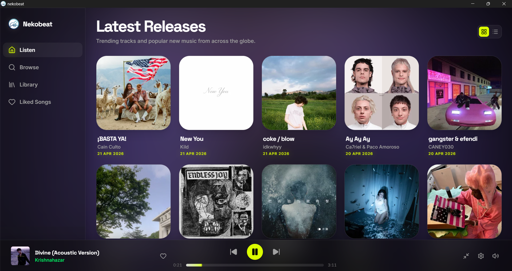
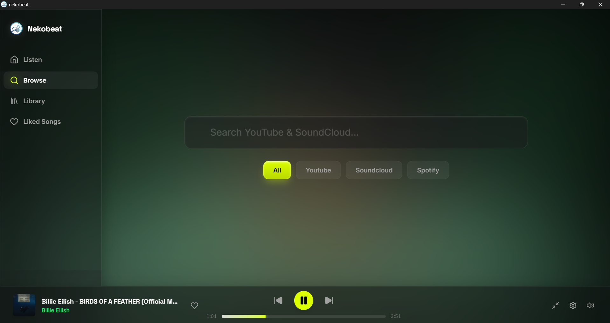
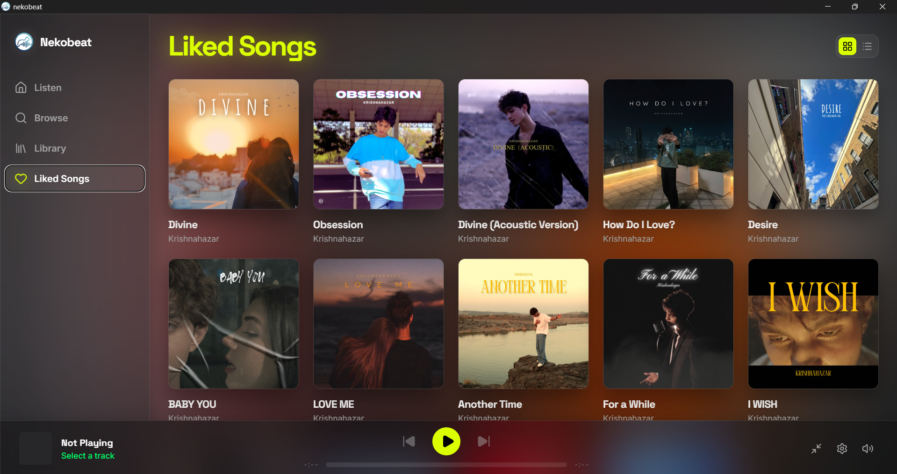
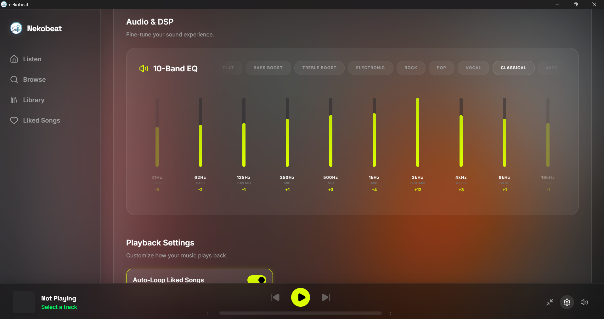
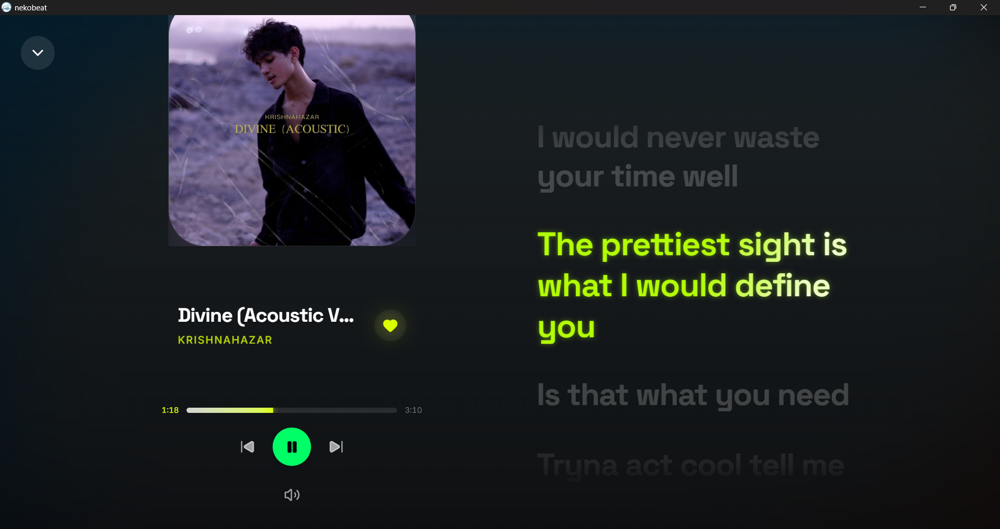

# 🎧 NekoBeat
**The Premium, Cross-Platform Music Aggregator.**

<p align="center">
  
</p>

## ✨ The NekoBeat Experience
NekoBeat isn't just a wrapper for a website; it is a native, hardware-accelerated audio engine. By combining the safety of Rust, the fluidity of React, and the sheer routing power of GStreamer, NekoBeat delivers an audiophile-grade experience without the bloat of traditional Electron apps.



## 🔍 Universal Audio Aggregation (NekoBrowse)
Stop jumping between apps. NekoBeat's core engine utilizes a custom yt-dlp backend to instantly resolve and stream high-quality audio from multiple sources.

- **The "Hero" Search**: A frictionless, perfectly centered search portal powered by Framer Motion.
- **Multi-Source Power**: Seamlessly pivot your queries between YouTube and SoundCloud with a single click.
- **Neon-Glass UI**: A stunning, hardware-accelerated frosted glass aesthetic.



## 💾 Instant Offline Caching
Your library belongs to you.

- **Local Liked Songs**: Hitting the "Like" button automatically caches the track directly to your local hard drive.
- **Zero-Latency Playback**: Your favorite songs play instantly, regardless of your internet connection or server status.



## 🎚️ Hardware-Level DSP (NekoEQ)
Audiophile control, built directly into the stream. We bypassed standard browser audio APIs to integrate a 10-Band GStreamer Equalizer.

- **Fine-Grain Control**: Sculpt your sound with 10 dedicated frequency bands ranging from 31Hz to 16kHz.
- **Zero Latency**: Adjustments are made directly to the Rust audio pipeline for real-time, stutter-free tuning.
- **Refined Master Volume**: Engineered with a sleek, vertical slider for maximum precision and an ultra-reactive hit area.



## 📰 The Scraper Engine (Listen Now)
Discover music without the forced algorithm.

- **Live Last.fm Scraping**: NekoBeat silently pulls the latest global trending tracks and metadata.
- **One-Click Routing**: See a trending track? Click it to instantly route the artist and title into the NekoBrowse aggregation engine.

## 📱 Native Mobile Fluidity (iOS & Android)
Tauri v2 allows NekoBeat to run natively on your phone, bringing desktop power to your pocket.

- **Framer Motion Gestures**: Buttery-smooth swipe-to-minimize and swipe-to-skip controls.
- **System Integration**: Full support for iOS/Android background audio, wake locks, and lock-screen media controls.

## 🎤 Custom Lyrics & Syncing
Your music, your words.
- **Manual Upload**: Upload your own `.lrc`, `.srt`, or `.vtt` subtitle files directly to any playing track.
- **Auto-Conversion**: The engine automatically converts formatting into synchronized `.lrc` behind the scenes.
- **Permanent Storage**: Uploaded lyrics are permanently stored in your local SQLite database or JSON registry, remaining synced to your tracks across app restarts.



## 🎮 Discord Rich Presence
Share your sonic aesthetic natively.

- **Zero-Bloat Integration**: Handled entirely by the Rust backend.
- **Live Sync**: Broadcasts track titles, artists, remaining time, and high-res album art directly to your Discord profile.

## 🛠️ The Architecture
- **Core**: Rust
- **App Framework**: Tauri v2
- **Frontend**: React + TypeScript
- **Styling**: Tailwind CSS
- **Animations**: Framer Motion
- **Audio Pipeline**: GStreamer + yt-dlp

## 🚀 Getting Started

### Prerequisites
To build NekoBeat locally, ensure you have the following installed:
- Node.js (Latest LTS)
- Rust & Cargo
- GStreamer development libraries (for the audio engine - Note: The Windows release now bundles these dependencies for a fully portable standalone experience).
- `yt-dlp` (must be accessible in your system PATH)

### Installation
1. Clone the repository:
   ```bash
   git clone https://github.com/nishal21/NekoBeat.git
   cd NekoBeat
   ```
2. Install frontend dependencies:
   ```bash
   npm install
   ```
3. Fire up the development server:
   ```bash
   npm run tauri dev
   ```

<p align="center">
Made with ❤️ by Nishal

<br>
<i>"Music is the wine that fills the cup of silence."</i>
</p>
