<div align="center">

# NekoBeat

**A native, cross-platform music aggregator built with Rust, React, and GStreamer.**


[](https://v2.tauri.app)
[](https://www.rust-lang.org)
[](https://react.dev)
[](LICENSE)
[](https://discord.gg/kKj8dqq6Je)
[](https://nishal21.github.io/NekoBeat-Website/)

[](https://buymeacoffee.com/kingtanjiro)
[](https://patreon.com/DemonKing08)
[](https://ko-fi.com/demon_king)
[](https://github.com/sponsors/nishal21)

[Download](https://github.com/nishal21/NekoBeat/releases/latest) | [Report Bug](https://github.com/nishal21/NekoBeat/issues) | [Discord](https://discord.gg/kKj8dqq6Je) | [Website](https://nishal21.github.io/NekoBeat-Website/)

</div>

---

NekoBeat is a real desktop app, not a website wrapped in Electron. Playback runs through GStreamer in Rust. The UI is React on Tauri v2. Search and stream from YouTube, SoundCloud, and Spotify in one place.

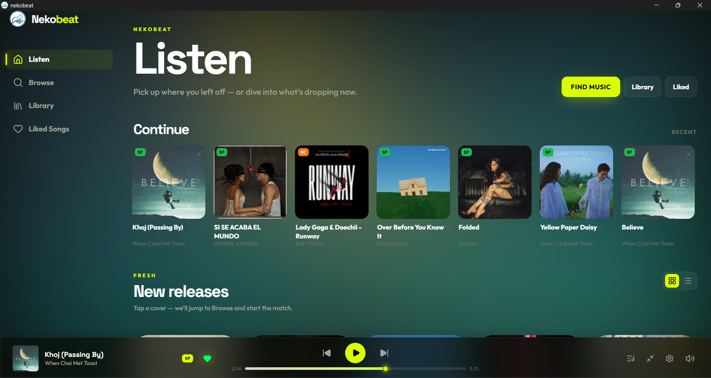

## Features

### Universal search and streaming

Search and stream from **YouTube**, **SoundCloud**, and **Spotify** in one UI. Streams are resolved with a custom scraping path and `yt-dlp` as fallback.

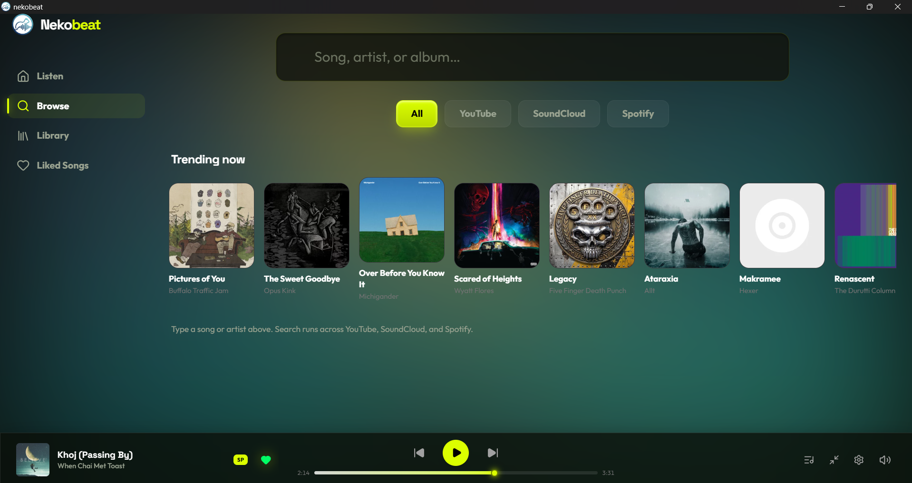

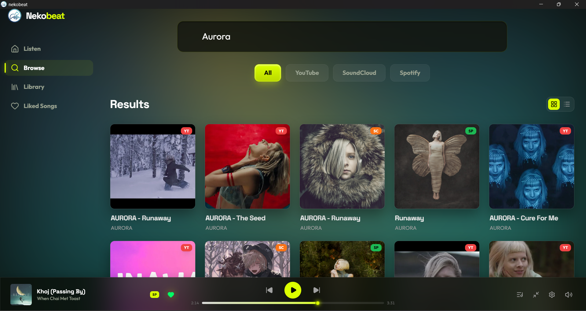

### Offline library

Liked tracks are cached on disk so they keep playing when you are offline.

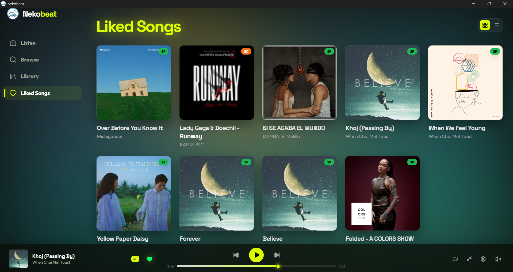

### 10-band equalizer

A GStreamer equalizer in the Rust audio pipeline: 10 bands from 31 Hz to 16 kHz, adjustable while music is playing.

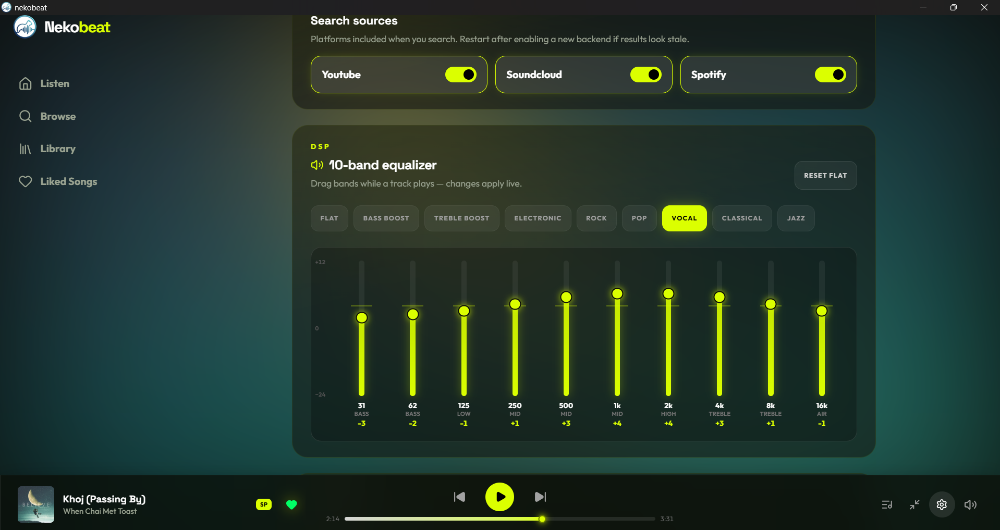

### Synchronized lyrics

Lyrics are fetched automatically (Genius and related sources). You can also upload `.lrc` / `.srt` / `.vtt`, tweak per-track timing offset, and keep them stored for later.

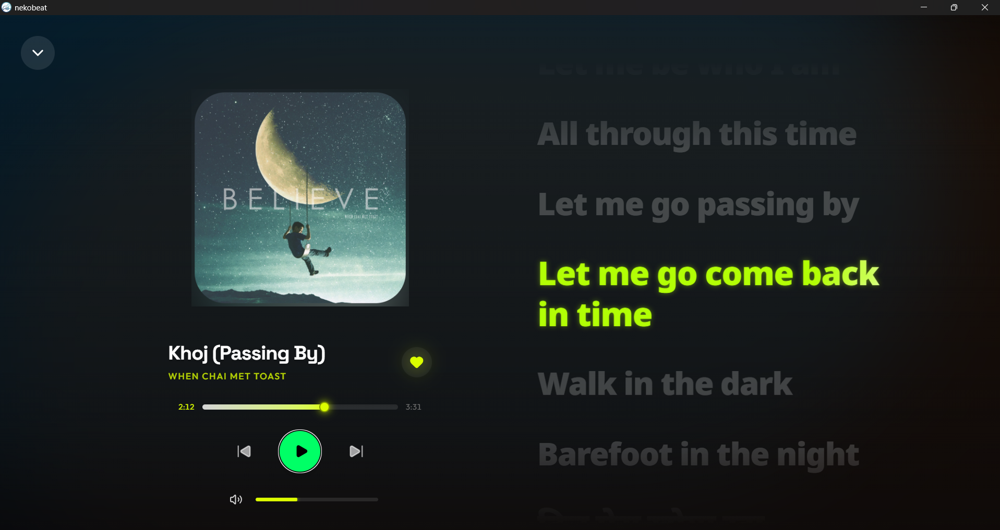

### YouTube video sync

For YouTube tracks, the video can play in an embedded window in sync with the audio.

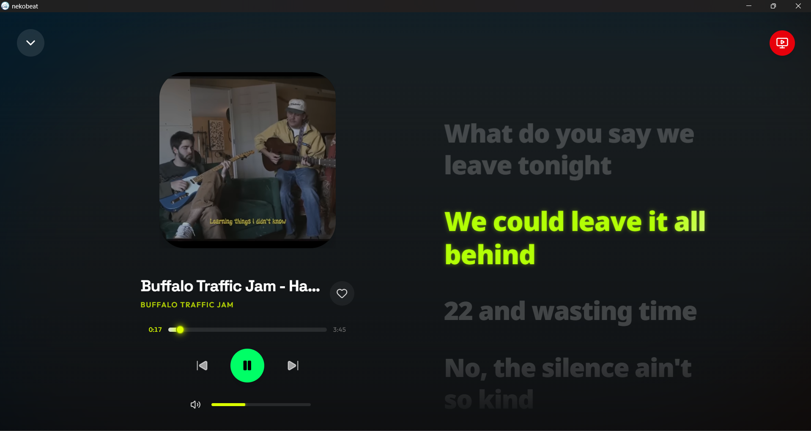

### Discover (Listen Now)

Last.fm trending tracks show up on Listen. One click sends a title into search.


### Discord Rich Presence

Title, artist, remaining time, and art show on your Discord profile. The Rust backend owns that path.

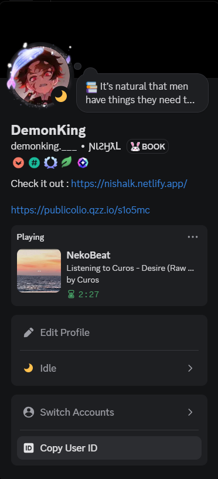

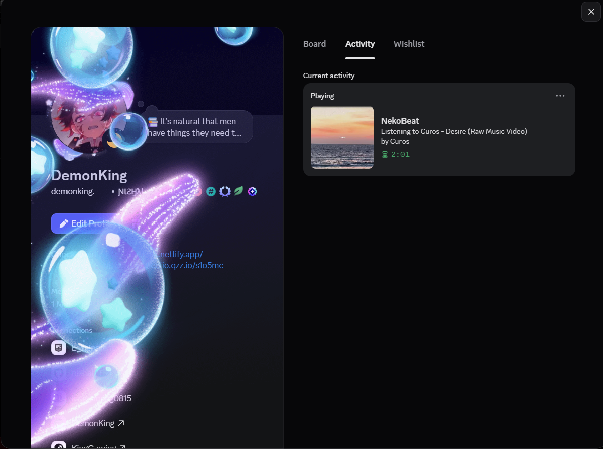

### Auto-updater

In-app update check and install via the Tauri updater plugin and signed releases.

### Picture-in-picture miniplayer

Small always-on-top player with art, track info, and controls. Drag by clicking anywhere. Shrink or expand with one click.

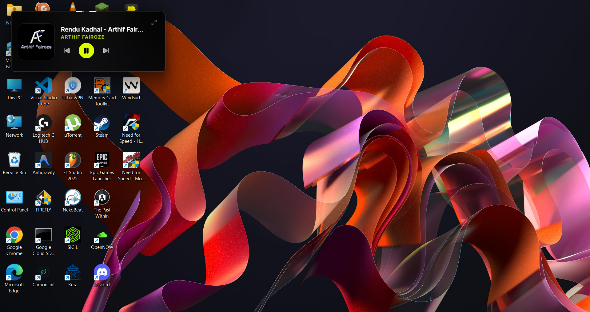

### Media session integration

Windows SMTC and macOS Now Playing: play, pause, next, previous, seek.

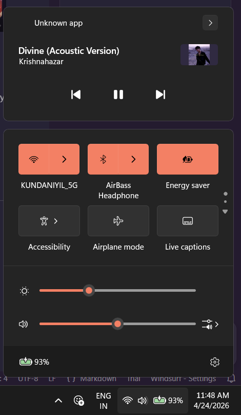

## Architecture

| Layer | Technology |
|-------|-----------|
| Core | Rust |
| Framework | Tauri v2 |
| Frontend | React + TypeScript |
| Styling | Tailwind CSS |
| Animations | Framer Motion |
| Audio engine | GStreamer |
| Stream resolution | Custom scraping + yt-dlp fallback |
| Database | SQLite (rusqlite) |
| Lyrics | Genius API scraping |

## Installation

### Windows (recommended)

Install with **winget** for updates:

```powershell
winget install NekoBeat
```

Or grab a build from [Releases](https://github.com/nishal21/NekoBeat/releases/latest):

- `NekoBeat_x64-setup.exe` (portable installer)
- `NekoBeat_x64.msi` (system-wide)

> The Windows installer already includes GStreamer. You do not need to install it yourself.

### Other platforms

- **macOS**: download from [Releases](https://github.com/nishal21/NekoBeat/releases/latest)
- **Linux**: `.deb` / AppImage from Releases
- **Android**: early library preview APK (local Library / Liked / Settings). Browse and streaming stay on desktop for now. 

### Build from source

**Prerequisites:**

- [Node.js](https://nodejs.org/) (LTS)
- [Rust](https://www.rust-lang.org/tools/install)
- [GStreamer](https://gstreamer.freedesktop.org/download/) development libraries
- [`yt-dlp`](https://github.com/yt-dlp/yt-dlp) on your PATH

```bash
git clone https://github.com/nishal21/NekoBeat.git
cd NekoBeat
npm install
npm run tauri dev
```

### Build a release

```powershell
# Signed Windows installer
.\scripts\build-release.ps1
```

That produces signed `.exe` and `.msi` installers plus `.sig` files for the auto-updater.

## Project structure

```
nekobeat/
├── src/                    # React frontend
│   ├── App.tsx             # Main application
│   └── hooks.ts            # Custom React hooks
├── src-tauri/
│   ├── src/
│   │   ├── main.rs         # Entry point & GStreamer init
│   │   ├── lib.rs          # Tauri command registration
│   │   ├── audio.rs        # GStreamer playback engine
│   │   ├── aggregator/     # Search, resolve, Spotify, SoundCloud
│   │   ├── offline.rs      # Local caching & liked songs
│   │   └── library.rs      # SQLite database operations
│   ├── gstreamer/          # Bundled GStreamer runtime
│   └── binaries/           # External tools (spotiflac-cli)
└── scripts/
    ├── build-release.ps1   # Signed release builder
    └── publish-update.ps1  # Update manifest generator
```

## Acknowledgments

NekoBeat borrows ideas and patterns from these projects:

- [Harmonoid](https://github.com/harmonoid/harmonoid) — Flutter music player; UI and local library ideas
- [Muffon](https://github.com/staniel359/muffon) — multi-source streaming client; aggregation shape
- [Muffon API](https://github.com/staniel359/muffon-api) — backend patterns for multi-source search
- [SpotiFLAC](https://github.com/afkarxyz/SpotiFLAC) — Spotify → lossless download chain used in NekoBeat's Spotify path
- [Spotify Lyrics API](https://github.com/akashrchandran/spotify-lyrics-api) — synced lyrics from Spotify
- [MusicXMatch API](https://github.com/Fabrice-Music/musicxmatch-api) — Musixmatch wrapper referenced for lyrics work

Thanks to everyone who maintains those projects.

## Community and support

- **Discord**: [Join the server](https://discord.gg/kKj8dqq6Je)
- **GitHub Discussions**: [Start a thread](https://github.com/nishal21/NekoBeat/discussions)
- **Website**: [NekoBeat](https://nishal21.github.io/NekoBeat-Website/)

## Star history

<a href="https://www.star-history.com/?repos=nishal21%2FNekoBeat&type=date&legend=top-left">
 <picture>
   <source media="(prefers-color-scheme: dark)" srcset="https://api.star-history.com/chart?repos=nishal21/NekoBeat&type=date&theme=dark&legend=top-left&sealed_token=2J0MgO3K9CCMXEL6GbNZZ5QbnvKfdrXxvcSpnAbloVEilYtz6RAYK_6nBKnoiKAAkxcf2oz33hcnWufYQnveOnYtTl5K8otz2xg0NUtVurzelqyEMfkhrg" />
   <source media="(prefers-color-scheme: light)" srcset="https://api.star-history.com/chart?repos=nishal21/NekoBeat&type=date&legend=top-left&sealed_token=2J0MgO3K9CCMXEL6GbNZZ5QbnvKfdrXxvcSpnAbloVEilYtz6RAYK_6nBKnoiKAAkxcf2oz33hcnWufYQnveOnYtTl5K8otz2xg0NUtVurzelqyEMfkhrg" />
   
 </picture>
</a>

> If NekoBeat is useful to you, a star on the repo helps a lot.

## License

NekoBeat is licensed under the [PolyForm Noncommercial License 1.0.0](LICENSE) ([SPDX: PolyForm-Noncommercial-1.0.0](https://spdx.org/licenses/PolyForm-Noncommercial-1.0.0.html)).

**Required notice:** Copyright (c) 2026 Nishal ([https://github.com/nishal21](https://github.com/nishal21))

In plain terms:

- You may use, study, fork, and change NekoBeat for personal and other noncommercial purposes.
- You may share forks and builds under the same terms.
- You may not use NekoBeat (or a modified version) for commercial purposes without a separate written license from the copyright holder.
- Commercial use includes selling the app, bundling it in a paid product, monetizing it with ads or subscriptions, or using it as part of a business offering.

Full text lives in [`LICENSE`](LICENSE) and at [polyformproject.org](https://polyformproject.org/licenses/noncommercial/1.0.0/).

---

<div align="center">

Made with care by [Nishal](https://github.com/nishal21)

*"Music is the wine that fills the cup of silence."*

</div>
